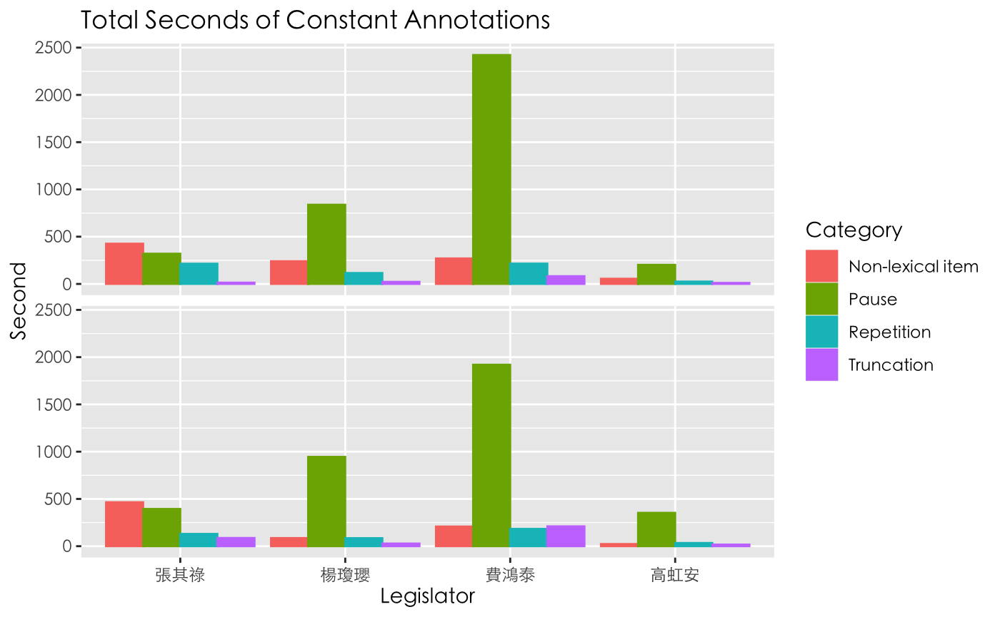
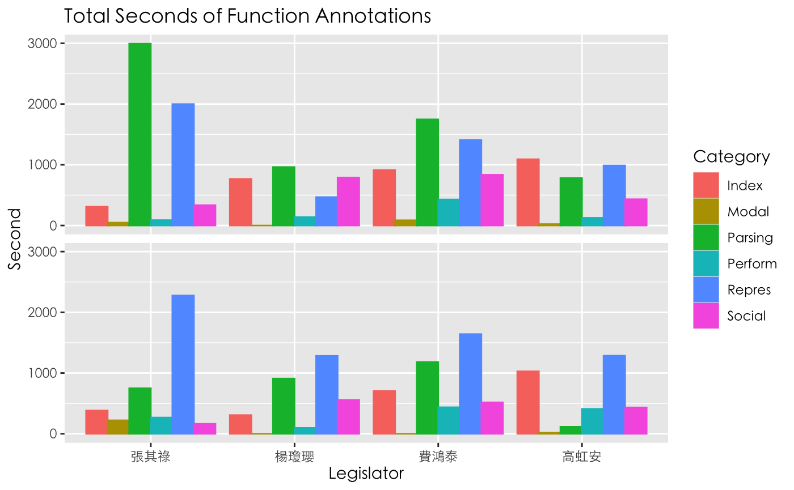
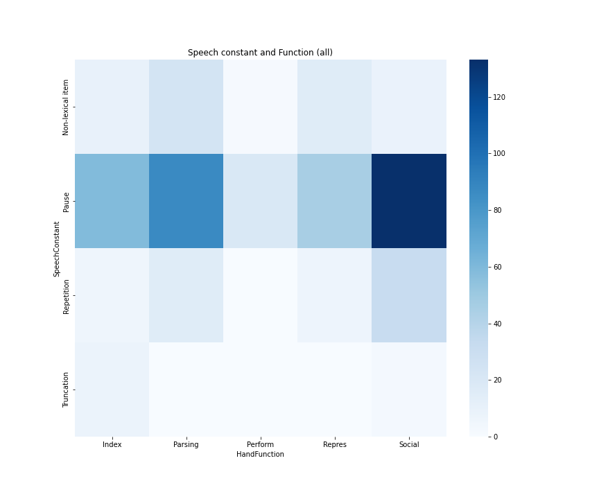

## Research Proposal

We attempt to explore multimodal features of an “ideal speaking style,” which may be reflected on higher citizen evaluation scores. In terms of the features, we take advantage of the MultiMoco as resources to examine the relationship between two types of non-verbal features: speech constant and the functions for hand gestures. With careful annotation of the one verbal and five non-verbal features, we attempt to answer the question: does speaker's speech constants (i.e., non-lexical items, pause, truncation, and repetition) during discourse co-occur with his/her hand gestures? and do these speech constants represent similar functions as the hand gestures?

Considering Debras’s (2021) suggestions for coarse-grained annotations, this study follows the concise annotation framework adopted by Camiciottoli and Bonsignori (2015). The speech constants will be annotated to examine the Lexical Retrieval Hypothesis evaluated by Trotta and Guarasci (2021), considering their results that gestures tend to co-occur with speech disfluency or hesitations. Referring to the guidelines in Voghera (2001), four types of speech constants (i.e., _pause_, _repetition_, _truncation_, and _non-lexical item_) are taken as the annotation targets. It is noted that the “semi-lexical” is renamed “non-lexical item” in our study. Subsequently, the category for hand functions comprises _social_, _representational_, _indexical_, _parsing_, _performative_, and _modal_, regarding the principles defined by Kendon (2004) and Weinberg, Fukawa-Connelly, and Wiesner (2013).

## Data Collection

Referring to the public information from the Citizen Congress Watch (CCW) on the evaluation of legislators in the 10th session of congress, we extracted and sorted the average scores of the citizen evaluation for 103 legislators. In order to ensure a balanced amount of data, we filtered 23 legislators with at least two videos based on the number of videos of each legislator in the MultiMoco. Finally, considering the evaluation scores, interpellation topics, and political parties, we eventually chose four legislators, two with higher evaluation scores and two with lower scores. A total of 8 interpellation clips were collected as two clips for each legislator were used to balance the data size. Each clip ranged about 8-12 minutes, including topics such as social welfare, education and culture, and finance.

## Annotation Overview

Each target in a clip was annotated by a set of two annotators separately. After annotated, the clips along with the annotations were divided into segments of 100ms for time alignment. Eventually, we have all clips annotated with four tiers (2 for speech constants and 2 for hand gestures). The inter-rater reliability was calculated by Cohen’s Kappa, which was 0.49 for speech constants and 0.81 for hand functions. The inter-rater reliability was considered acceptable for the following analysis. The annotation results are shown in the two figures below.

  
   

## Co-occurrence Analysis

This study aims to discuss whether verbal disfluency co-occurs with more gestures than verbal fluency. Specifically, we attempt to see which hand function tends to appear when there are speech constants, and whether the hand function actually corresponds to the speech constants.

First, the overall distribution is shown in the heatmap below. It can be observed that pause occur the most, with a total of 345 segments. First of all, Social (hand function) and pause (speech constant) have the highest co-occurrence frequency. Subsequently in the column of Social, repetition (speech constant) also co-occurs frequently. This result slightly disagrees with our original assumption that speech constants are mostly used for verbal disfluencies; that is, instead of hesitation pauses in discourse, these pauses and repetitions mostly co-occur at the point when the speaker utilize hand gestures to emphasize an important message.

  

In addition, the co-occurrence of Parsing (hand function) and pause is the second most frequent in the heatmap. Similarly, Parsing and non-lexical item (speech constant) also have some co-occurring segments. Referring to our annotators, Parsing is annotated when the speakers use certain hand gestures to beat the rhythm, open a new talking turn. In particular, the speakers often repeat the same gesture for a few seconds while speaking (e.g., nodding, waving hands, or finger-pointing), and the actions are usually unrelated to their verbal contents. We then return to the heatmap and find that pause and non-lexical item also co-occur with Parsing, though slightly fewer than their co-occurence with Social. The latter group is thus in line with our assumption that verbal disfluency will co-occur with hand gestures functioning as Parsing.

## Conclusion

As prior research have suggested that when speakers are more disfluent in speech, they tend to use more hand gestures (e.g., Trotta and Guarasci, 2021), we attempt to see which hand function tends to appear when there are speech constants, and whether the hand function actually corresponds to verbal disfluency. Our results show that the speech constants (i.e., pause, non-lexical item, repetition) co-occur more frequently with the hand gestures for emphasizing messages (i.e., Social). Yet, we still find that the speech constants show obvious co-occurence with hand gestures for beating the rhythm or changing talking turns (i.e., Parsing), which is in line with the theories in previous studies.

As this study are limited to the analysis of the co-occurrence of speech constants and hand gestures, we marked the segments of speech constants and hand gestures manually, which might be imprecise and biased. Also, we did not consider the weights of length and the exact timepoints when the hand gestures happended. Therefore, we may further utilize automatic speech recognition (ASR) and computer vision to capture the exact timepoints of the speech constants and hand gestures. In addition, we may also
explore the co-occurrence of body postures as well, which may provide more insights into the relationship between speech constants and multimodal expressions.

---

## References

* Camiciottoli, B.C., & Bonsignori, V. (2015). The Pisa Audiovisual  
Corpus Project: A Multimodal Approach To Esp Research And Teaching. ESP Today, 3, 139-159.
Camille Debras. (2021). How to prepare the video component of the Diachronic Corpus of Political Speeches for multimodal analysis. Research in Corpus Linguistics 9/1,132-151. DOI 10.32714/ricl.09.01.08.
Kendon, A. (2004). Gesture: Visible action as utterance. Cambridge University Press.
Trotta, D., & Guarasci, R. (2021). How are gestures used by politicians? A multimodal co-gesture analysis. IJCoL. Italian Journal of Computational Linguistics, 7(7-1, 2), 45-66.
Weinberg, A., Fukawa-Connelly, T., & Wiesner, E. (2013). Instructor gestures in proof-based mathematics lectures. In Proceedings of the 35th annual meeting of the North American Chapter of the International Group for the Psychology of Mathematics Education (Vol. 1119).
Voghera, M. (2001). Teorie Linguistiche E Dati Di Parlato. In Dati Empirici E Teorie Linguistiche, 75–96. Roma: Bulzoni.
