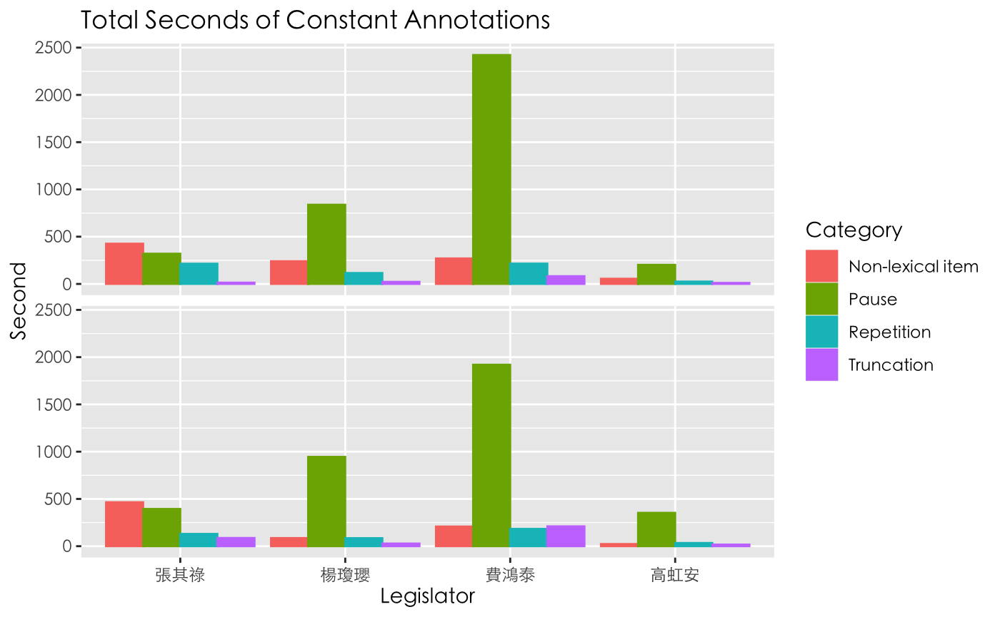
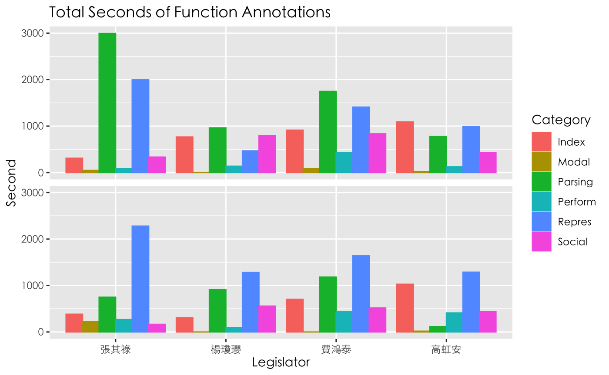

## Research Proposal

We attempt to explore multimodal features of an “ideal speaking style,” which may be reflected on higher citizen evaluation scores. In terms of the features, we take advantage of the MultiMoco as resources to examine the relationship between two types of non-verbal features: speech constant and the functions for hand gestures. With careful annotation of the one verbal and five non-verbal features, we attempt to answer the question: does speaker's speech constants (i.e., non-lexical items, pause, truncation, and repetition) during discourse co-occur with his/her hand gestures? and do these speech constants represent similar functions as the hand gestures?

Considering Debras’s (2021) suggestions for coarse-grained annotations, this study follows the concise annotation framework adopted by Camiciottoli and Bonsignori (2015). The speech constants will be annotated to examine the Lexical Retrieval Hypothesis evaluated by Trotta and Guarasci (2021), considering their results that gestures tend to co-occur with speech disfluency or hesitations. Referring to the guidelines in Voghera (2001), four types of speech constants (i.e., _pause_, _repetition_, _truncation_, and _non-lexical item_) are taken as the annotation targets. It is noted that the “semi-lexical” is renamed “non-lexical item” in our study. Subsequently, the category for hand functions comprises _social_, _representational_, _indexical_, _parsing_, _performative_, and _modal_, regarding the principles defined by Kendon (2004) and Weinberg, Fukawa-Connelly, and Wiesner (2013).

## Data Collection

Referring to the public information from the Citizen Congress Watch (CCW) on the evaluation of legislators in the 10th session of congress, we extracted and sorted the average scores of the citizen evaluation for 103 legislators. In order to ensure a balanced amount of data, we filtered 23 legislators with at least two videos based on the number of videos of each legislator in the MultiMoco. Finally, considering the evaluation scores, interpellation topics, and political parties, we eventually chose four legislators, two with higher evaluation scores and two with lower scores. A total of 8 interpellation clips were collected as two clips for each legislator were used to balance the data size. Each clip ranged about 8-12 minutes, including topics such as social welfare, education and culture, and finance.

## Annotation Overview

Each target in a clip was annotated by a set of two annotators separately. After annotated, the clips along with the annotations were divided into segments of 100ms for time alignment. Eventually, we have all clips annotated with four tiers (2 for speech constants and 2 for hand gestures). The inter-rater reliability was calculated by Cohen’s Kappa, which was 0.49 for speech constants and 0.81 for hand functions. The inter-rater reliability was considered acceptable for the following analysis. The annotation results are shown in the two figures below.

## Co-occurrence Analysis

This study aims to discuss whether verbal disfluency co-occurs with more gestures than verbal fluency. Specifically, we attempt to see which hand function tends to appear when there are speech constants, and whether the hand function actually corresponds to the speech constants.

First, the overall distribution is shown in Figure 1. It can be observed that pauses occur the most, with a total of 345 times. First of all, social (hand function) and pause (speech constant) have the highest co-occurrence frequency. In the same column, social (hand function) and repetition (speech constant) occur frequently. This result overturns our original understanding of " The idea of speech constant indicates verbal disfluency”, that is, instead of hesitation pauses, these pauses and repetitions function at the point when the speaker wants to emphasize an important message.

The combination of parsing (hand function) and pause (speech constant) is the second most frequent in the concatenated list. Similarly, parsing (hand function) and non-lexical item (speech constant) also have some co-occurrence marks in the same column . When parsing is marked, it is often used to beat the rhythm, open a new talking turn, or repeat the same gesture for a few seconds while speaking, keep nodding, shaking hands... etc. Actions that do not correspond to nominal content. The phenomenon that can be observed here is that the pauses and non-lexical items of the speakers are often combined with pauses and non-lexical items when speaking, and at the same time, there will be relatively meaningless rhythmic gestures in the gestures. This type is more in line with our assumption that verbal disfluency will co-occur with gesture, and the frequency of occurrence is also very high.

## Conclusion

the inability to gesture can cause verbal disfluencies (Dobrogaev 1929).

Notice that the results are consistent with the Tradeoff Hypothesis (De Ruiter, Bangerter, and Dings 2012). Qualitative analysis shows that when respondents are more disfluent in speech, they gesticulate more.

Results show that hand movements tend to co-occur with full pauses (i.e. repetition) and empty pauses (i.e. pause) and more frequently with interjections (i.e. semi-lexical), suggesting that gesticulating may represent an attempt at lexical retrieval. In future developments we plan to extend the analysis taking into account more recent theories,

Concerning gesture-speech relationship, the results obtained suggest that hand movements are mainly used with an integrative and complementary functions. So, the information provided by such gestures adds precision and emphasis to linguistic information

## References

Camiciottoli, B.C., & Bonsignori, V. (2015). The Pisa Audiovisual Corpus Project: A Multimodal Approach To Esp  
 Research And Teaching. ESP Today, 3, 139-159.
Camille Debras. (2021). How to prepare the video component of the Diachronic Corpus of Political Speeches for
multimodal analysis. Research in Corpus Linguistics 9/1,132-151. DOI 10.32714/ricl.09.01.08.
Kendon, A. (2004). Gesture: Visible action as utterance. Cambridge University Press.
Trotta, D., & Guarasci, R. (2021). How are gestures used by politicians? A multimodal co-gesture analysis. IJCoL.
Italian Journal of Computational Linguistics, 7(7-1, 2), 45-66.
Weinberg, A., Fukawa-Connelly, T., & Wiesner, E. (2013). Instructor gestures in proof-based mathematics lectures.
In Proceedings of the 35th annual meeting of the North American Chapter of the International Group for the Psychology of Mathematics Education (Vol. 1119).
Voghera, M. (2001). Teorie Linguistiche E Dati Di Parlato. In Dati Empirici E Teorie Linguistiche, 75–96. Roma:  
 Bulzoni.
